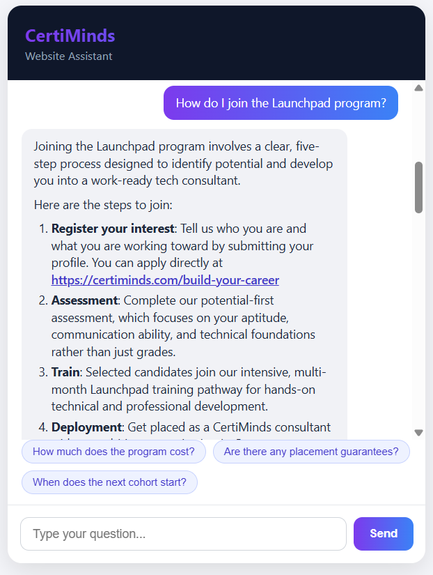

# CertiMinds Website Chatbot

A RAG chatbot that answers questions using only content from certiminds.com,
built for the CertiMinds Stage 3 technical assessment.

## Screenshot

## How it works

1. A crawler scrapes certiminds.com and converts each page to markdown.
2. Pages are chunked, tagged with their real source URL, and embedded with the Gemini embedding model.
3. At query time:
   - The question is checked against a local answer cache first. A hit returns instantly with no API calls.
   - An intent check filters out vague or unclear questions and asks the user to clarify instead of guessing what they meant.
   - Relevant chunks are retrieved and filtered by a relevance threshold, not a fixed top-k, so an answer only pulls in as much context as is actually relevant.
   - An answer is generated using only that context, written as CertiMinds' own voice (no "based on the context" phrasing), in the same language the question was asked in (English or Arabic).
   - When relevant, the answer includes a real clickable link to the specific page on certiminds.com (never a relative path).
   - A guardrail check verifies the answer stays grounded in the retrieved content before it's shown to the user, and the answer is cached for next time.
   - Three follow-up question suggestions are generated based on the conversation so far, shown as clickable buttons.
4. A simple web UI (Flask) and a command-line chat are both available.

## Project structure

    certiminds-chatbot/
    ├── crawler.py              # crawls certiminds.com and saves raw HTML per page
    ├── convert_to_markdown.py  # strips nav/footer/scripts and converts HTML to markdown
    ├── chunker.py               # splits markdown into overlapping chunks, tags each with its source URL
    ├── build_index.py          # embeds chunks with the Gemini API and saves index.json
    ├── add_urls_to_index.py   # one-time migration: adds source URLs to an existing index.json
    ├── cache.py                  # local cache of question to answer, avoids repeat API calls
    ├── rag.py                   # core pipeline: cache check, intent check, retrieval, generation, guardrail check, suggestions
    ├── chat.py                  # command-line entry point to talk to the chatbot
    ├── app.py                    # Flask web app entry point, tracks per-session chat history
    ├── eval_questions.py       # runs a fixed set of test questions (including adversarial ones) through the pipeline
    ├── list_models.py          # lists which Gemini models this API key has access to
    ├── main.py                  # unused boilerplate from project setup, safe to ignore
    │
    ├── templates/
    │   └── index.html           # web chat UI page
    ├── static/
    │   ├── style.css            # web chat UI styling
    │   └── script.js            # web chat UI behavior: rendering, markdown formatting, suggestions
    ├── screenshots/
    │   └── chatbot-demo.png    # screenshot of the web UI in use
    │
    ├── pages/                   # raw HTML saved by crawler.py, one file per page
    ├── markdown/                 # cleaned markdown saved by convert_to_markdown.py
    ├── index.json               # embedded chunks used for retrieval, built by build_index.py
    ├── link_table.csv          # log of pages crawled and links found on each
    ├── answer_cache.json       # cached question to answer pairs, grows as the chatbot is used
    ├── eval_output.txt         # saved output from a full eval_questions.py run
    │
    ├── pyproject.toml          # project dependencies, managed by uv
    ├── uv.lock                  # exact locked dependency versions for reproducible installs
    ├── .python-version          # python version pinned for this project
    ├── .env                      # your actual API key, excluded from the repo via .gitignore
    ├── .env.example             # template showing which environment variables are needed
    └── .gitignore                # excludes .env, .venv, __pycache__ from version control

## Setup

Requires Python and uv (https://docs.astral.sh/uv/).

Clone the repository:

    git clone https://github.com/MuniebA/certiminds-chatbot.git
    cd certiminds-chatbot

Install dependencies:

    uv sync

Create a `.env` file in the project root (see `.env.example`):

    GEMINI_API_KEY=your_key_here

Get a free key from Google AI Studio: https://aistudio.google.com/app/apikey

## Running it

The pre-built `index.json` is included, so you can go straight to running
the chatbot without re-crawling.

Command-line version:

    uv run python chat.py

Web UI version:

    uv run python app.py

Then open http://127.0.0.1:5000 in a browser.

To rebuild everything from scratch instead of using the included index:

    uv run python crawler.py              # scrape certiminds.com
    uv run python convert_to_markdown.py  # clean HTML into markdown
    uv run python build_index.py          # embed and build the search index

## Testing

    uv run python eval_questions.py > eval_output.txt

Runs a fixed set of questions through the full pipeline, including normal
questions, vague questions, off-topic questions, and adversarial prompts
(prompt injection, system prompt extraction, jailbreak attempts, encoded
input) to demonstrate the guardrails hold up under deliberate misuse.

## Assumptions

- The website is small enough (10 pages) that a plain numpy similarity search is used instead of a vector database.
- Only same-domain links are crawled; external links (social media, etc.) are excluded.
- The chatbot answers only from retrieved context and explicitly says when something isn't covered on the website, rather than guessing.
- Free-tier Gemini API rate limits apply (both per-minute and per-day caps depending on the model); the code retries automatically on rate-limit and server-overload errors, and the answer cache reduces how often the API is hit at all.
- The website content itself is English-only; Arabic support works by instructing the model to answer in the question's language while translating from the English source content, since the embedding model places both languages in the same vector space.
- Page URLs are recovered from each crawled page's saved filename, since the site's pages are all single-segment paths (e.g. certiminds.com/contact).

## Notable design choices

- Dynamic relevance filtering instead of fixed top-k retrieval: only chunks above a similarity threshold are used as context.
- A lightweight intent check runs before retrieval, asking the user to clarify vague questions instead of guessing what they meant.
- A guardrail check runs after generation to verify the answer is actually grounded in the retrieved context before it's shown to the user, catching potential hallucination.
- A local answer cache stores previously-answered questions (normalized to catch minor wording differences) so repeat questions return instantly with zero additional API calls.
- Bilingual support (English and Arabic) with no separate translation step or additional model, since the underlying embedding and generation models are natively multilingual.
- The assistant speaks as CertiMinds itself, never referencing "the context" or "the provided text", and includes real clickable links to specific pages when relevant, rather than bare relative paths.
- Answers are formatted for readability (short paragraphs, real list structure) rather than a single dense block of text, and the web UI renders that structure (bold text, numbered and bulleted lists, clickable links) instead of showing raw markdown syntax.
- Dynamic follow-up suggestions are generated from the conversation so far and shown as clickable buttons, so the user can continue the conversation with one click instead of typing.
- A simple Flask web UI is included alongside the command-line version for easier live demonstration.

## Known limitations

- Free-tier API quotas are modest (requests per minute and per day); a production deployment would use a paid tier or a fallback chain across multiple models.
- The answer cache matches on normalized exact wording, not semantic similarity, so differently-phrased repeat questions won't hit the cache even if they mean the same thing.
- The website was crawled once; if certiminds.com changes, `index.json` needs to be rebuilt by re-running the crawl and index steps.
- Suggested follow-up questions add one extra API call per turn, so they consume free-tier quota faster during heavy testing.